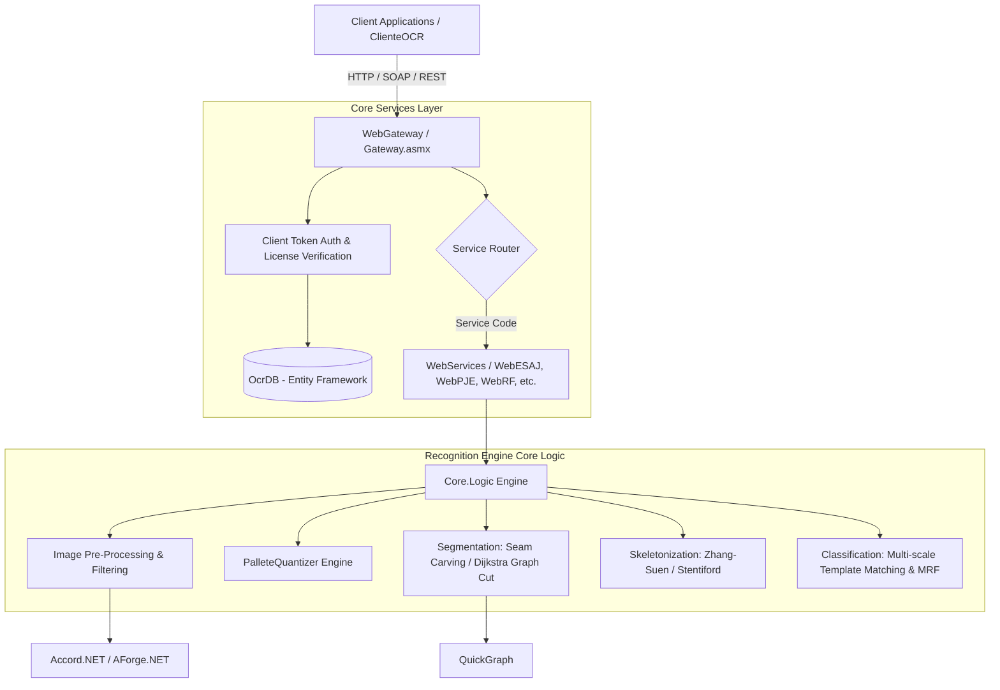

# 🛡️ CAPTCHA Solver Framework - Automated OCR for Brazilian Portals

[](https://dotnet.microsoft.com/)
[](https://docs.microsoft.com/en-us/dotnet/csharp/)
[](http://www.accord-framework.net/)
[](#)

An enterprise-grade **Computer Vision and Automated CAPTCHA Recognition Framework** built in **C# / .NET**. Designed specifically for high-volume automated processing of visual text CAPTCHAs found across Brazilian legal (e-SAJ, PJe, TRT), tax/fiscal (Receita Federal, NFe, Sintegra), and financial/consignado portals.

The system combines advanced image pre-processing algorithms (color quantization, custom filtering, morphological operations), intelligent character segmentation (Seam Carving, Dijkstra graph shortest paths), template matching classification, and a centralized web service gateway (`WebGateway`) with token-based license management and usage telemetry.

---

## 📋 Table of Contents

- [Key Features](#-key-features)
- [Supported Portals & Services](#-supported-portals--services)
- [System Architecture](#-system-architecture)
- [Computer Vision & Recognition Pipeline](#-computer-vision--recognition-pipeline)
- [Project Structure](#-project-structure)
- [Technology Stack](#-technology-stack)
- [Database Setup & Configuration](#-database-setup--configuration)
- [Getting Started & Usage](#-getting-started--usage)
- [Testing & Quality Assurance](#-testing--quality-assurance)

---

## ⚡ Key Features

- **Multi-Portal Support**: Ready-to-use solvers for dozens of Brazilian government and legal web portals.
- **Advanced Color Quantization**: Custom high-performance color reduction library (`PalleteQuantizer`) implementing 8 quantization algorithms (Octree, Median Cut, Wu, NeuQuant, etc.) and 11 dithering techniques (Floyd-Steinberg, Atkinson, Sierra, etc.).
- **Smart Character Segmentation**:
  - **Seam Carving**: Dynamic programming energy-minimization path calculation to split overlapping characters.
  - **Dijkstra Graph Search**: Shortest path graph cuts (`QuickGraph`) for complex noise and line disruptions.
  - **Spectral Clustering & K-Means**: Unsupervised pixel grouping for background/foreground separation.
- **Morphological Pre-processing**: De-skewing/straightening (`Endireitamento`), Zhang-Suen & Stentiford skeletonization/thinning, Circle Hough Transforms, and Gaussian/Median filtering.
- **Centralized API Gateway (`WebGateway`)**:
  - Unified web service interface (`Gateway.asmx`) wrapping all individual CAPTCHA solver engines.
  - Token-based client authentication and subscription licensing via Entity Framework.
  - Request logging and ELMAH integrated error diagnostics.
- **Dataset Generation Tool (`BaixarImagensCaptcha`)**: Built-in scraper for automated dataset collection and solver training.
- **Desktop Client Utility (`ClienteOCR`)**: WinForms application for testing solvers, managing API keys, and debugging image pipelines.

---

## 🏛️ Supported Portals & Services

| Service Code | System / Institution | Portal Description |
| :--- | :--- | :--- |
| **`ESAJ`** | **e-SAJ** | Tribunal de Justiça (TJSP, TJSC, etc.) - Processos Digitais |
| **`PJE`** | **PJe** | Processo Judicial Eletrônico (Justiça Estadual / Federal) |
| **`TRTSP`** | **TRT-2 / TRT-SP** | Tribunal Regional do Trabalho da 2ª Região |
| **`TJPE`** | **TJPE** | Tribunal de Justiça de Pernambuco |
| **`TJMG`** | **TJMG** | Tribunal de Justiça de Minas Gerais |
| **`PROJUDI`** | **Projudi** | Projudi AM, MA, AL, BA e Geral |
| **`RF` / `RF3` / `RF4`** | **Receita Federal** | Consulta CNPJ / CPF (Versões 1, 3 e 4) |
| **`NFE`** | **Portal NFe** | Consulta de Nota Fiscal Eletrônica |
| **`SP`** | **Sintegra SP** | Secretaria da Fazenda de São Paulo |
| **`RJ`** | **Sintegra RJ** | Secretaria de Estado de Fazenda do Rio de Janeiro |
| **`MG`** | **Sintegra MG** | Secretaria de Estado de Fazenda de Minas Gerais |
| **`AM`** | **Sintegra AM** | Secretaria de Estado da Fazenda do Amazonas |
| **`SI`** | **Siscarga / Sintegra** | Sistema de Controle de Carga e Sintegra |
| **`CRJ` / `CRJa` / `CRJv`**| **ConsigRJ** | Portal ConsigRJ (Consignados RJ) |
| **`CA` / `CAM`** | **ConsigAeronautica** | Portal de Consignações da Força Aérea Brasileira |
| **`CM`** | **ConsigMarinha** | Portal de Consignações da Marinha do Brasil |

---

## 🏗️ System Architecture



---

## 🔬 Computer Vision & Recognition Pipeline

1. **Filtering & Noise Cleaning**
   - Application of Gaussian Blur, Median filters, and custom contrast filters (`GringoFilter`) to eliminate background noise grid lines and salt-and-pepper artifacts.
2. **Palette Quantization & Color Reduction**
   - Reduction of full-color bitmaps into minimal palettes using algorithms like Xiaolin Wu, Octree, or NeuQuant neural quantization to isolate text colors.
3. **De-skewing & Geometry Normalization**
   - Detection of baseline inclination and rotation using `Endireitamento` algorithms and Circle Hough Transforms (`CircleHough`) for warped text correction.
4. **Character Segmentation**
   - Splitting overlapping or connected characters using:
     - **Seam Carving**: Finds lowest-energy vertical paths through the image.
     - **Dijkstra Graph Cuts**: Represents image pixels as a graph using `QuickGraph` and computes shortest paths across background pixels.
5. **Thinning & Feature Extraction**
   - Morphological skeletonization using Zhang-Suen or Stentiford algorithms to derive single-pixel width character skeletons.
6. **Pattern Recognition & Classification**
   - Matching extracted character components against pre-calculated template collections (`TemplateMatching`) with normalized penalty matrices.

---

## 📁 Project Structure

```
CAPTCHA/
├── Core/
│   ├── Common/              # Extension methods, byte array helpers, base utilities
│   ├── Data/                # Entity Framework Data Access Layer (OcrDB.edmx, Clients, Usage Logging)
│   └── Logic/               # Primary Recognition Engine
│       ├── Captchas/        # Specialized solvers for each portal (CaptchaESAJ, CaptchaRF4, etc.)
│       ├── Filtros/         # Image filters (Gaussian, GringoFilter, Median)
│       ├── Predict/         # Prediction runners and result evaluators
│       ├── RemocaoFundo/    # Background removal (K-Means, Erosion)
│       ├── Separacao/       # Character segmentation (SeamCarving2, ColorFilling)
│       ├── SpectralCluster/ # Spectral clustering algorithms
│       ├── Tratamento/      # Morphological operations (Zhang-Suen thinning, De-skewing, Hough)
│       └── TemplateMatching.cs # Multi-scale pattern recognition engine
├── PalleteQuantizer/        # Independent C# library for Palette Quantization & Dithering
│   ├── Quantizers/          # Octree, MedianCut, NeuQuant, XiaolinWu, Uniform, Popularity
│   └── Ditherers/           # Floyd-Steinberg, Atkinson, Burkes, Sierra, Stucki, etc.
├── SimplePaletteQuantizer/  # Lightweight palette quantization reference project
├── WebServices/             # ASP.NET Web Services per target portal
│   ├── WebGateway/          # Central API Proxy with License Control & ELMAH Error Signal
│   ├── WebESAJ/, WebPJE/, WebRF/, WebNFE/, WebTRTSP/, etc.
├── ClienteOCR/              # WinForms GUI client for testing OCR services and managing tokens
├── BaixarImagensCaptcha/    # Automated GUI tool to scrape & download CAPTCHA sample datasets
├── DeteccaoDeObjetos/       # Experimental object detection module
├── IntegrationTests/        # MSTest unit and integration test suite with sample test images
├── WebservicesTest/         # End-to-end integration tests for web service endpoints
└── Samples/                 # Test image samples categorized by CAPTCHA service
```

---

## 🛠️ Technology Stack

- **Framework**: Microsoft .NET Framework 4.0 / 4.5
- **Languages**: C#, T-SQL, ASP.NET Web Services (ASMX)
- **Computer Vision & Math Libraries**:
  - **[Accord.NET](http://www.accord-framework.net/)** (v2.12): Machine learning and advanced mathematics.
  - **[AForge.NET](http://www.aforgenet.com/)** (v2.2.5): Image processing and spatial filtering.
  - **[QuickGraph](https://github.com/YaccConnect/QuickGraph)** (v3.6): Graph data structures and Dijkstra shortest path solvers.
  - **RestSharp**: REST API HTTP client communications.
- **Database & Data Access**: Entity Framework 4+ (EDMX Model), SQL Server.
- **Error Diagnostics**: ELMAH (Error Logging Modules and Handlers).
- **Testing**: MSTest, SharpTestsEx.

---

## 🗄️ Database Setup & Configuration

1. **Database Script Execution**:
   - Run `Core/Data/OcrDB.edmx.sql` in Microsoft SQL Server to create the `ocrdb` database, `Clientes` table, and `Requisicoes` logging table.
   - Run `ElmahDatabaseScript.sql` to install ELMAH error logging tables and stored procedures.
2. **ConnectionString Setup**:
   - Update `connectionStrings` in `WebServices/WebGateway/Web.config` and `Core/Data/App.Config`:
     ```xml
     <add name="ocrdbEntities" 
          connectionString="metadata=res://*/OcrDB.csdl|res://*/OcrDB.ssdl|res://*/OcrDB.msl;provider=System.Data.SqlClient;provider connection string=&quot;data source=YOUR_SERVER;initial catalog=ocrdb;integrated security=True;MultipleActiveResultSets=True;App=EntityFramework&quot;" 
          providerName="System.Data.EntityClient" />
     ```

---

## 🚀 Getting Started & Usage

### 1. Build the Solution
Open `Captchas.sln` in **Visual Studio** (2012 or newer) and restore NuGet packages:
```bash
nuget restore Captchas.sln
```
Build the solution targeting **Debug** or **Release** configuration.

### 2. Consuming the Web Gateway API
Clients authenticate using a valid API `Token` issued in the `Clientes` database table.

#### Example C# API Client Call:
```csharp
using System.IO;
using System.Drawing;
using ClienteOCR.WS_Gateway; // Reference to WebGateway service

class Program
{
    static void Main()
    {
        var client = new GatewaySoapClient();
        
        // Load target CAPTCHA image
        byte[] imageBytes = File.ReadAllBytes("captcha_sample.png");
        using (var ms = new MemoryStream(imageBytes))
        using (var img = Image.FromStream(ms))
        {
            string token = "YOUR-GUID-LICENSE-TOKEN";
            string service = "ESAJ"; // e-SAJ tribunal service code
            
            // Invoke Gateway solver
            string recognizedText = client.GetText(service, imageBytes, img.Width, img.Height, token);
            
            System.Console.WriteLine($"Recognized CAPTCHA Text: {recognizedText}");
        }
    }
}
```

---

## 🧪 Testing & Quality Assurance

The `IntegrationTests` project contains automated test suites that run solver engines against actual sample image sets located in the `Samples/` directory:

To run integration tests via Visual Studio Test Explorer or Developer Command Prompt:
```bash
vstest.console.exe IntegrationTests\bin\Release\PredictTests.dll
```

Tests evaluate recognition accuracy for specific portal types:
- `CaptchaESAJTest.cs`
- `CaptchaRF4Test.cs`
- `CaptchaNFETest.cs`
- `CaptchaPJETest.cs`
- `CaptchaTRTSPTest.cs`

---

## 📄 License

This codebase is a private proprietary solution designed for automated CAPTCHA recognition across Brazilian legal and government systems. All rights reserved.
